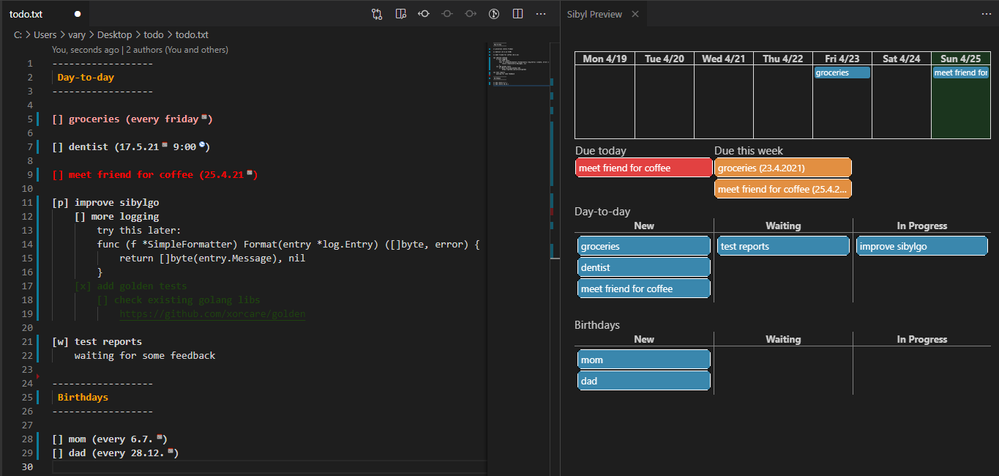

# sibylgo

 [](https://sonarcloud.io/dashboard?id=sandro-h_sibylgo)

Text-based TODO application.

It lets you write TODO list as you want (within the bounds of the syntax).
You can add arbitrary additional text and comments to the todos. The application will never reformat your TODO file, so you have full control of it.

**Disclaimer: This tool is for my own personal use. Feedback and requests are welcome, but not necessarily acted upon.**

## Features

* Simple, human-readable text format
* Hierarchical todos, recurring todos, arbitrary todo comments
* VSCode extension to view & edit your todo.txt with format highlighting
* VSCode commands to `clean` and `trash` done todos. `clean` moves them to end of file, `trash` moves them to todo-trash.txt
* VSCode preview panel with overview of upcoming todos and kanban-ish
  new/waiting/in progress board.
* VSCode creates links for JIRA ticket keys.
* Reminder mails for due todos
* Automatic todo for open Bitbucket Server PRs to review.
* MS Outlook integration to add dated todos as private calendar events.
* Simple local HTML calendar page
* git-based **local** backups: on save and daily



## Limitations

* Limited support for time-of-day. Almost all features ignore time-of-day, the core granularity is days. Time of day is just an information for the user.
* No built-in device syncing (but todo.txt file can be synced with standard file sharing services, e.g. Dropbox)
* No mobile app (though you can view & edit the todo.txt in a mobile text editor)

## Components

### Backend

The backend does all the heavy lifting:

* Parsing the text todo file
* Providing formatting & folding information for the VSCode extension
* Providing information for VSCode preview panel
* Providing data for HTML calendar
* Providing commands to clean and trash done todos
* Sending mail reminders for upcoming todos
* Creating backups of the todo file
* Inserting todos from external sources

The backend is a `sibylgo.exe` (Windows) or `sibylgo` (Linux) console application that can be started in the background somewhere. All the other components interact with it via REST calls.

### VSCode extension

The VSCode extension is a thin client that interacts with the backend
and formats the todo file if opened in VSCode.  
Also handles folding of hierarchical todos and provides the clean and
trash commands in the command palette and editor context menu.

The extension is a `sibyl.vsix` file that can be installed manually with:

```shell
code --install-extension sibyl.vsix
```

Or via the "Install from VSIX..." option in the VSCode extension GUI.

### Calendar

The calendar is a simple `sibylcal.html` file that displays the
current month/week/day, using data from the backend.

## Text syntax

### General notes

* Many aspects of the syntax can be configured. See the Configuration section.

### Category

```text
------------------
 My category
------------------
```

With HTML color (to differentiate calendar entries):

```text
------------------
 My category [Coral]
------------------
```

### Todo

```text
[] my open todo
[x] my done todo
```

Hierarchical todos:

```text
[] my top-level todo
    [] my child todo
    [x] my done child todo
        [] more stuff
```

Work states:

```text
[] my open todo
[p] my in progress todo
[w] my waiting todo
[x] my done todo
```

Comments:

```text
[] my top-level todo
    some random comment.
    it needs to be indented.

    [] child todo
        a comment for the child todo
```

On a specific day:

```text
[] get groceries (15.11.20)
```

At a specific date and time:

```text
[] get groceries (15.11.20 08:00)
```

Time range:

```text
[] vacation (10.11.20-15.11.20)
[] new house (10.11.20-)
[] study for example (-15.11.20)
```

Recurring:

```text
[] get groceries (every day)
[] get groceries (today)

[] gym (every Tuesday)
[] team meeting (every 2nd Tuesday)
[] project meeting (every 3rd Tuesday)
[] company meeting (every 4th Tuesday)

[] vacuum (every 10.)

[] John's birthday (every 5.10)
```

Important (!):

```text
[] pick up from airport!
[] even more important!!
```

## Configuration

### Minimal sibylgo.yml

```yaml
todoFile: path/to/todo.txt
```

### Full sibylgo.yml

```yaml
log_level: info
todoFile: path/to/todo.txt
host: localhost

parse:
  category_delim: "------"
  indent: "\t"
  lbracket: "["
  rbracket: "]"
  priority_mark: "!"
  inprogress_mark: "p"
  waiting_mark: "w"
  done_mark: "x"
  date_formats: ["02.01.06", "02.01.2006", "2.1.06", "2.1.2006"]
  time_format: "15:04"
  # week_days must start with Sunday:
  week_days: ["sunday", "monday", "tuesday", "wednesday", "thursday", "friday", "saturday"]
  daily_pattern: "(?i)(every day|today)"
  weekly_pattern: "(?i)every (monday|tuesday|wednesday|thursday|friday|saturday|sunday)"
  nth_weekly_pattern: "(?i)every (2nd|3rd|4th) (monday|tuesday|wednesday|thursday|friday|saturday|sunday)"
  nths: ["2nd", "3rd", "4th"]
  monthly_pattern: "(?i)every (\\d{1,2})\\.?$"
  yearly_pattern: "(?i)every (\\d{1,2})\\.(\\d{1,2})\\.?$"

optimized_format: true

mailHost: smtp.example.com
mailPort: 3025
mailFrom: foo@example.com
mailTo: bar@example.com
mailUser: foo
mailPassword: lepass

external_sources:
  prepend: true
  bitbucket_prs:
    bb_url: http://bitbucket.example.com
    bb_user: myuser
    bb_token: aba1234
    category: Today
  dummies:
    dummy_moments:
      - id1:name1
      - id2:name2

outlook_events:
  enabled: true
```

## Development

### Terminology

Internally, "todos" have two different variants:

* `moment` - a todo or event **definition**. I.e. as declared in the todo.txt file.
* `instance` - an actual "occurrence" of a `moment` in a specified time range. For example, the moment `[] groceries (every Tuesday)` would have 4 `instances` or "occurrences" in a 4 week time range; one on each Tuesday in the time range.

### Building

Main Go application:

```shell
make deps
make build
```

VSCode Extension:

```shell
cd VSCode_ext
make deps
make build
```

### Testing

Some tests rely on input/output testdata files. The output files for all tests can be updated to what
the test is actually outputting with: `go test ./... -update-golden`

For easier comparison between actual and expected output, the test output
can also be written to a temporary file instead of the real golden file:
`go test ./... -update-golden -dry-golden`

### Releasing

Make sure to update and commit `version.txt`.

```shell
make release
```

Pushes a release tag which triggers a CI build that includes a release job.
